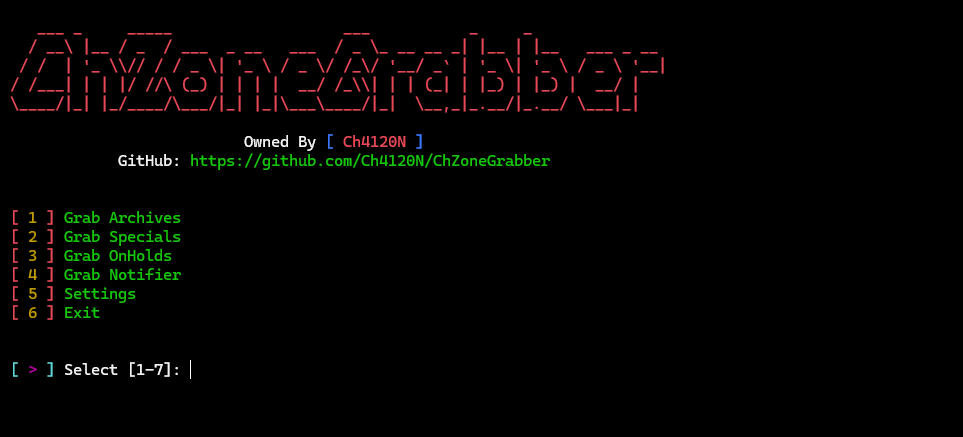
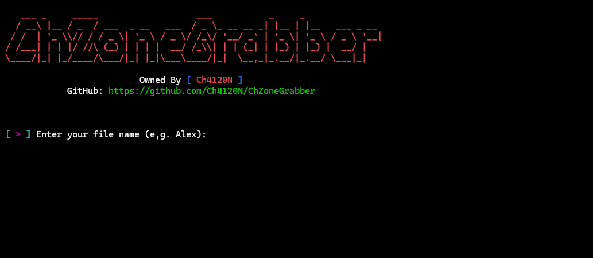
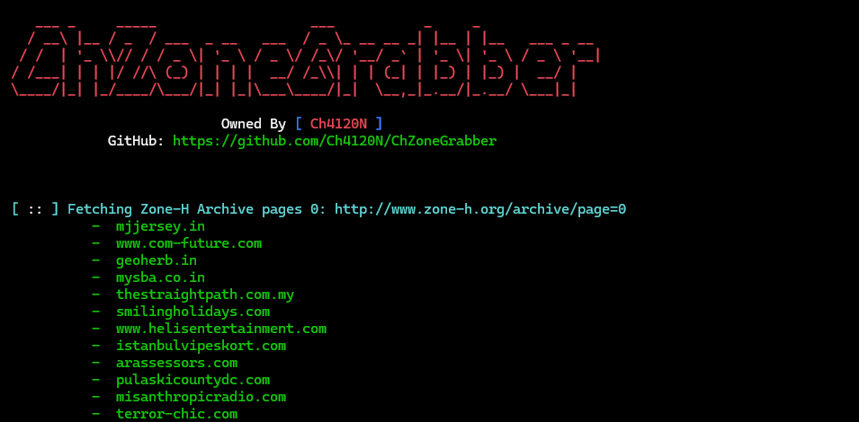

<div align="center">


# ChZoneGrabber

### _**Simple Zone-H Grabber Tool**_


---

> **ChZoneGrabber** is a simple zone-h grabber tool written in Python 3 with advanced error handling, beautiful ui. Perfect for **Beginner Penetration Testers** **authorized security testing**, **penetration testing**, and **cybersecurity research**.

</div>

---

## 📋 Table of Contents

- 👨‍💻 [Project Programmer](#-project-programmer)
- 🧠 [Made For](#-made-for)
- 🖼️ [Screenshots](#️-screenshots)
- ⚓ [Requirements](#-requirements)
  - 📦 [Installing Dependencies](#-installing-dependencies)
- ⚙️ [Installation Guide](#️-installation-guide)
  - [Linux](#linux)
  - [Windows](#windows)
  - [macOS](#macos)
- 💻 [Supported Platforms](#-supported-platforms)
- ✨ [Features](#-features)
- 💻 [Usage](#-usage)
- ⚙️ [Configuration](#️-configuration)
- 📊 [Output Files](#-output-files)
- ❤️ [Support the Project](#️-support-the-project)
- ⚠️ [Disclaimer](#️-disclaimer)
- 🚨 [Reporting Issues](#-reporting-issues)

---

## 👨‍💻 Project Programmer

> **Ch4120N** — [Ch4120N@Proton.me](mailto:Ch4120N@Proton.me)

---

## 🧠 Made For

> **Security researchers**, **Beginner penetration testers**, and **Cybersecurity professionals** who need websites with vulnerabilities for **authorized security testing**, **penetration testing**, and **network security assessment**.

---

## 🖼️ Screenshots

<div align="center">

| Main Interface | Interactive Mode | Grabbing Display |
| :---: | :---: | :---: |
|  |  |  |

</div>

---

## ⚓ Requirements

- **Python 3.7+**
- **pip** (Python package manager)

### 📦 Installing Dependencies

```bash
python -m pip install -r requirements.txt
```

---

## ⚙️ Installation Guide

### Linux

```bash
sudo apt install python3 git -y
git clone https://github.com/Ch4120N/ChZoneGrabber.git
chmod 755 -R ChZoneGrabber
cd ChZoneGrabber
python3 -m pip install -r requirements.txt
python3 ChZoneGrabber.py
```

### Windows

If you have Git installed:

```cmd
git clone https://github.com/Ch4120N/ChZoneGrabber.git
cd ChZoneGrabber
python -m pip install -r requirements.txt
python ChZoneGrabber.py
```

Otherwise, [download the ZIP release](https://github.com/Ch4120N/ChZoneGrabber/releases), extract it, and run it directly.

### macOS

```bash
brew install python3 git
git clone https://github.com/Ch4120N/ChZoneGrabber.git
cd ChZoneGrabber
python3 -m pip install -r requirements.txt
python3 ChZoneGrabber.py
```

---

## 💻 Supported Platforms

- [x] **Linux** (All distributions)
- [x] **Windows** (7, 8, 10, 11)
- [x] **macOS** (All versions)

---

## ✨ Features
- **🎨 Beautiful UI**: Colorful terminal interface with ASCII banners and formatted tables
- **📝 Comprehensive Logging**: Detailed logs for successful urls and errors
- **🛑 Graceful Shutdown**: Clean interruption handling with SIGINT support
- **💬 Interactive Mode**: User-friendly interactive prompts for easy configuration
- **⏱️ Configurable**: Users can configure settings
---

## 💻 Usage
### Quick Start
- First of all you need to go to the [Zone-H](https://www.zone-h.org/) website
- Next you need to take two values ​​from Zone-H website. Open **Developer Tools** in your browser and go to `applications > cookies` section and save `ZHE` and `PHPSESSID` values ​​in one place
- Then enter the script with the following command:
    ```bash
    python ChZoneGrabber.py
    ```
- Select **option 5 (Settings)** and paste the values ​​you copied in `ZHE` and `PHPSESSID` fields
- If you have completed all the steps correctly, **congratulations**, you can now use the script.

> [!TIP]
> You should almost always do all of these steps.

> [!TIP]
> Usually, because the script is faster, it is better to have the browser open because most of the time the user needs to authenticate to show that they are human.

## ⚙️ Configuration
### Default Settings

The tool uses the following default configurations (defined in `core/config.py`):

```ini
[CONFIG]
# The output files are placed inside this directory.
output_dir = reports/
# The time and date are added after the name of each file.
time_date = true
# maximum number of pages for crawling
max_pages = 50

# You definitely need to define these two variables in order to be able to do this.
# Read the project's documentation file: "README.md" 
# Or
# visit this page: https://github.com/Ch4120N/ChZoneGrabber
[ZONE-H CONFIG]
ZHE = 
PHPSESSID = 
```

---
## 📊 Output Files
All output files are saved in the to default `reports/` directory (You can change it in settings menu on the script or change it from `config.cfg` file):

**reports/Alex2025-11-16_03-02.txt**

```
https://example.com
https://website.org
```

---

## ❤️ Support the Project

If you find this tool useful, consider donating:

| Cryptocurrency | Address                                      |
| :------------- | :------------------------------------------- |
| **BTC**        | `bc1ql4syps7qpa3djqrxwht3g66tldyh4j7qsyjkq0` |
| **ETH**        | `0xfddbd535a4ad28792cbebceee3d6982d774e6d13` |
| **USDT**       | `3Cq6HRQsiwZFmPEQfG9eJkZE2QGChvf2VN`         |

> 💖 Your support helps keep the project alive and improving!

---

## ⚠️ Disclaimer

**This tool is for educational and authorized security testing purposes only.**

- ⚠️ **Unauthorized access to computer systems is illegal**
- ⚠️ **Only use this tool on systems you own or have explicit written permission to test**
- ⚠️ **The authors are not responsible for any misuse of this software**
- ⚠️ **Use responsibly and in compliance with applicable laws**

**By using this tool, you agree to use it only for legitimate security testing and educational purposes.**

---

## 🚨 Reporting Issues

> If you encounter bugs, configuration issues, or unexpected behavior, please reach out:
> 📩 **Ch4120N@Proton.me**

---
<div align="center">

"Simple Zone-H Grabber tool. Crawl at time"

**⭐ If you like this project, don't forget to give it a star!**

[](https://github.com/Ch4120N/ChZoneGrabber)
[](https://github.com/Ch4120N/ChZoneGrabber)

**Made with ❤️ by Ch4120N**

</div>